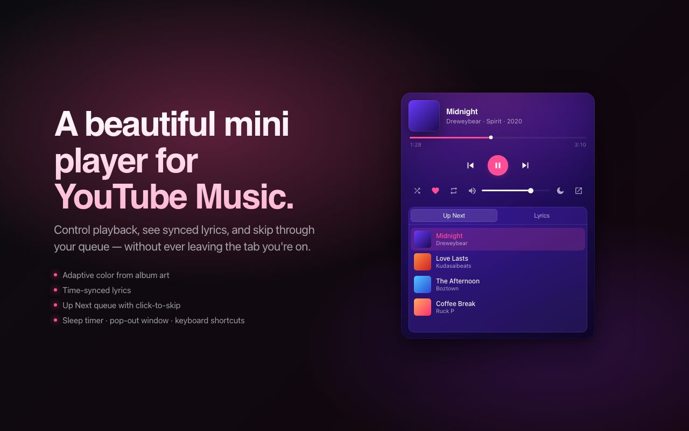
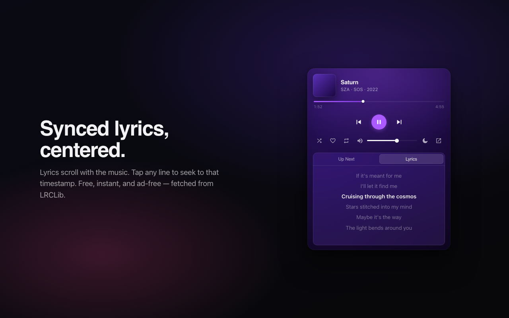
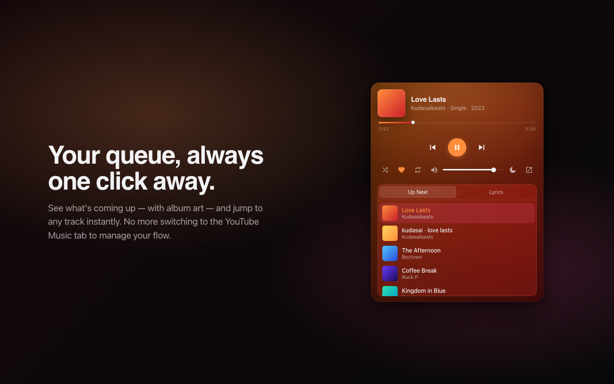
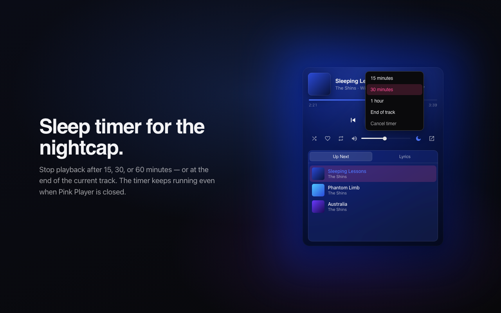
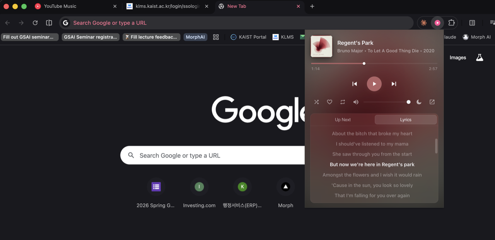
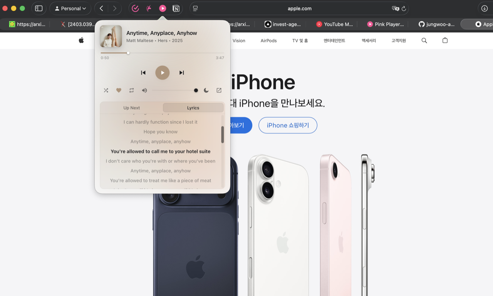

# Pink Player

Mini player for **YouTube Music** — in Chrome and Safari. Adaptive color from the album art, synced lyrics, queue, sleep timer, keyboard shortcuts. No tracking, no ads.

## Get it

| 🌐 [pink-player site](https://jungwoo-ahn.github.io/pink-player-site/) | 🟢 [Add to Chrome](https://chromewebstore.google.com/detail/pink-player-%E2%80%94-mini-for-yo/aaikooaeajlfemfgfmembjkpbppmfloo) | 🍎 [Download for Mac](https://github.com/jungwoo-ahn/pink-player-site/releases/tag/mac-v1.0-debug) |
| :---: | :---: | :---: |
| The landing page | Chrome Web Store | Safari (experimental, Apple Silicon only) |

## Features

| Synced lyrics | Queue at a glance | Sleep timer |
| :---: | :---: | :---: |
|  |  |  |

## Out in the wild

**Chrome**

**Safari**

## What's in this repo

This is the **public landing page + Mac release host** for Pink Player.

- [`index.html`](./index.html) — the landing page served at [jungwoo-ahn.github.io/pink-player-site](https://jungwoo-ahn.github.io/pink-player-site/)
- [`privacy.html`](./privacy.html) — privacy policy
- [`screenshots/`](./screenshots) — image assets used by the page + this README
- [GitHub Releases](https://github.com/jungwoo-ahn/pink-player-site/releases) — public-facing Mac downloads

The extension source code lives in a separate (currently private) repo.

---

[Privacy](./privacy.html) · Unofficial third-party tool. Not affiliated with or endorsed by YouTube or Google.
